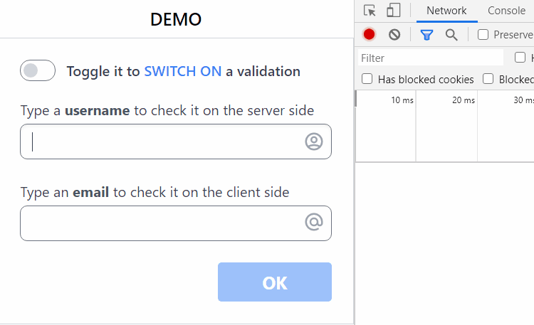

# vue-next-validator

Javascript library of _server-side_ and/or _client-side_ validation for _*Vue 3*_ applications implemented with help of the Composition API hooks.

### 🔥 `One function does all work to validate your data!`
```ts
function validate(conditions, source, callback, options = { delay: 500 });
```
* `conditions` - it allows to detect the moment when your data are ready to be validated;
for example: the field in a form may be empty so that you don't need to validate it;
'conditions' source must be a getter function that returns a value, or directly a ref;
* `source` - a getter function or directly a ref to data which should be validated;
* `callback` - a user's function that will do a vlidation;
              it will called from vue-next-validator as *callback(value, fnValid, fnInvalid)*;
* `options` - if delay = 0, validation will be called immediately.

### 🚀 **`DEMO`**: click to open an _[interactive page](https://github.com/belset/vue-next-validator/demo-package)_, and _[source codes](https://github.com/belset/vue-next-validator/demo-package)_ for that

#

#

## ⚡ Usage


Refer to [functions list](#functions) for more details.


### Vue template
```html
<div>
  <input type="text" v-model="state.user"/>
  <span v-if="validation.user.valid">User is valid</span>
  <span v-else-if="validation.user.invalid">User is invalid</span>
  <span v-else-if="validation.user.validating">Validating...</span>
</div>
```

### Javascript
```ts
import { validate, isEmail } from 'vue-next-validator'

export default {
  setup() {
    const state = reactive({
      user: null,
      email: null
    });

    const validation = {
      
      user: validate(
        () => state.user && state.user.length > 2, // conditions to start validation, or not
        () => state.user, // 'state.user' is a value that has to be validated
        (value, valid, invalid) => { // 'value'='state.user'; 'valid' and 'invalid' - callback functions to inform about validation result; additinal data can be passed; 
          const data = awat fetch(`https://api.agify.io/?name=${encodeURIComponent(value)}`);
          if (data.count > 0)
            valid({ name: value, count: data.count });
          else
            invalid({ name: value });
        }
      ),

      email: validate(() => state.email, () => state.email, isEmail, { delay: 0 }),

      isOkEnabled: () => validation.user.valid && validation.email.valid
    };

    return {
      state, validation
    };
  }
}
```

## 📦 Install

> 🎩 It works for Vue 3 **within a single package** by the power of [vue-demi](https://github.com/belset/vue-next-validator)!

```bash
npm i vue-next-validator
```


### Injected functions
```ts
export const isInt = (val) => val != "" && !isNaN(val) && Math.round(val) == val;
export const isFloat = (val) => val != "" && !isNaN(val) && Math.round(val) != val;
export const isCurrency = (val) => /^\d+(?:\.\d{0,2})$/.test(val);
export const isDigit = (val) => /^\d*$/.test(val);
export const isUrl = (val) => /...?/.test(val);
export const isEmail = (val) => /...$/.test(val);
```
These functions are added in the package, just import it and use together vithe the _validation_ function 
```ts
import { validate, isEmail } from 'vue-next-validator'
```

### CDN

It is not implemented yet.


## 🧱 Contribute

See the [**Contributing Guide**](https://github.com/belset/vue-next-validator/contributing)

## 📄 License

